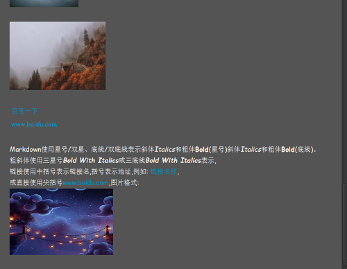

# MarkdownPanel
MarkdownPanel是一个Markdown解析器,主要用来返回TornadoFX控件的可视化View组件

# 使用

```kotlin
class MarkdownFileListView : View() {
    // 注入MKFileModel用于设置markdown文件 -> fileModel.item = File([markdown文件路径])
    private val fileModel: MKFileModel by inject()
    override val root = vbox {
        listview(markdownFileStore.mkFiles) {
            // ...
            setOnMouseClicked {
                   /**
                    *  MarkdownPanelFragment会完成解析并得到最终的View
                    *  你可以将该View添加到任何TornadoFX组件中
                    */
                   find<MarkdownPanelFragment>().openWindow(owner = null)
            }
        }
    }
}
```
---




# 与JavaFX集成
#### MarkdownPanel与JavaFX集成非常简单,只需要两个步骤。
- 第一步:第一步准备markdown文件并将该文件注入MKFileModel
- 第二步:获得MarkdownPanelFragment并得到它的ScrollPane
- 第三部:是用自己的CSS样式覆盖掉默认的样式

示例代码参考: [MarkdownPanelForJavaFXDemo.java](src/main/java/red/medusa/markdownpanel/Integrate_to_javafx_demo/MarkdownPanelForJavaFXDemo.java)


# API

```kotlin
val filePath = Data::class.java.classLoader.getResource("data/markdown-file/mk/A.md")?.file
val data = Data(File(filePath))

    data
        .prepared()         // 准备数据
        .parse()            // 构建数据
    
	// 这里就可以获得所有markdown成品信息了,我们可以用这些信息完成自己的个性化解析,不论是
	// 使用TornadoFX或JavaFX,或GroovyFX...
    data.getLines().forEach {
                println(it)
            }  
    // ------------------------- output : -------------------------        
    //  Line(number=1, text=A.md, inlineText=null, prefix=null, postfix=null, tagParse=TITLE, segmentView=class red.medusa.markdownpanel.view.OneTitleSegment, isHandle=false, isLine=true)
    //  Line(number=2, text=, inlineText=null, prefix=null, postfix=null, tagParse=BLANK, segmentView=class red.medusa.markdownpanel.view.BlankSegment, isHandle=false, isLine=true)
    //  ...  
```

`Line`表示解析之后的每一行,根据`Line`来进行第二道解析完成TornadoFX View,它包含了提供给`Segment`的所有信息

```kotlin
    data class Line(
        val number: Int,
        var text: String,
        var segmentView: KClass<out Segment> = ParagraphSegment::class        // 解析成段落的具体实现类
        //  ...
    ) 
```

`Segment`实际上是一个生成JavaFX布局控件的组件,利用它最终完成所需的视图控件,例如像Panel或HBox之类的控件

```kotlin
  class Segment : Pane() {
    // ...
     open fun getSegment(/*... */ ): Pane? = vbox { }
  }
```
